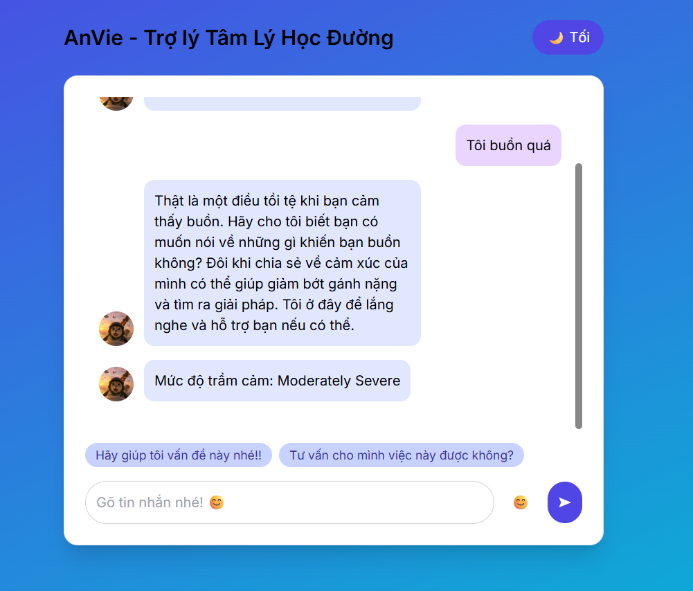
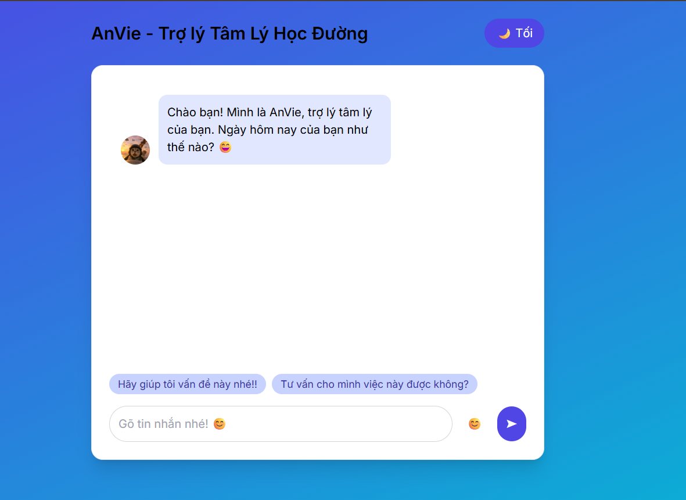

# Chatbot_AnVie

# Giới thiệu về Chatbot
Đây là AI đánh giá mức độ trầm cảm người dùng thông qua giao tiếp với Chatbot. Mục đích của Bot: có khả năng trò chuyện tự nhiên, thấu cảm và phù hợp với tâm lý sinh viên.

# Định hướng triển khai(Hiện tại):
Xây dựng một model có khả năng nhận diện mức độ trầm cảm thông qua Text (Text Classification):
 - Dữ liệu thu thập nguồn từ: Bộ dữ liệu: PHQ-9 Student Depression Dataset - https://data.mendeley.com/datasets/kkzjk253cy/1
 - Dữ liệu mẫu khá ít cho mục đích fine-tune mô hình --> Sử dụng phương pháp tăng cường dữ liệu (Data Augmentation) giúp cân bằng nhãn và tăng số lượng mẫu.
 - Fine-tune mô hình: Mô hình PhoBERT (mô hình xử lý ngôn ngữ Tiếng Việt ổn định hiện tại), kết quả sau khi fine-tune: Tỉ lệ Accuracy = 85% và F1-score = 0.85 trên tập test, tỉ lệ cao hơn mô hình gốc (28%) và Gemini(23%)
 - Hiện tại mô hình đã được push lên hugging face cho tiện sử dụng: TTDattt/PhoBERT-DepressionClassification-fine-tune
 - Mô hình vẫn đang được cải thiện trong thời gian tới

Xây dựng Giao diện Chatbot:
 - Sử dụng ReactJS để xây dựng một giao diện dễ sử dụng và thân thiện với người dùng

Xây dựng Back-end Chatbot:
 - Bot gồm 2 modules chính : 1. Module giao tiếp: Hiện tại, tôi đang sử dụng API của OpenRouter - LLM: LLaMA để giao tiếp với người dùng
 - 2. Module nhận diện mức độ trầm cảm: Là mô hình tôi đã xây dựng

# Hướng dẫn:
 - Git clone --
  - Đối với Backend: Tạo 1 môi trường ảo : python -m venv venv
                                            source venv/bin/activate   # hoặc venv\Scripts\activate trên Windows
                                            pip install -r requirements.txt
   - Đối với FE: npm start -- Bot sẽ chạy trên http://localhost:3000/
   - Đối với mô hình tôi xây dựng: Tôi đẩy mã nguồn lên github. Nếu bạn muốn chạy thử, tôi khuyến nghị bạn sử dụng colabgoogle với T4 GPU, vì có 1 số API cá nhân nên tôi đã ẩn, bạn hãy sử dụng API của bạn nhé.

# Hướng phát triển thời gian tới:
Vì dự án này vẫn còn trong thời gian phát triển nên đây chỉ là bản mở đầu của dự án, tương lai AI này sẽ được phát triển thêm về CSDL, AI Agent,...

# Một số hình ảnh demo:

